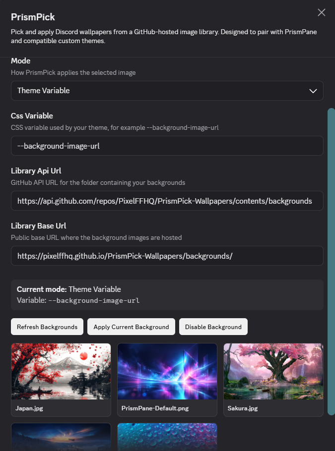

# PrismPick

A Vencord wallpaper picker by **PixelFF**.

PrismPick lets you browse and apply Discord wallpapers directly from Vencord using a GitHub-hosted image library.

It is designed to pair with **PrismPane**, but can also work with compatible third-party themes or in its standalone Universal Mode.

---

## Download

[Download the latest PrismPick release](https://github.com/PixelFFHQ/PrismPick/releases/latest)

PrismPick currently requires a source-built Vencord installation.

---

## Features

- Browse wallpapers directly inside Vencord settings
- Thumbnail gallery with active-background indicator
- Apply wallpapers without restarting Discord
- Remembers the selected wallpaper between restarts
- Built-in official PixelFF wallpaper library
- Support for custom GitHub-hosted wallpaper libraries
- Theme Variable Mode for compatible Discord themes
- Universal Mode for use without a wallpaper-aware theme
- Custom CSS variable support
- Refresh and reapply controls
- Disable wallpaper without disabling the plugin

---

## PrismPane

PrismPick is the companion wallpaper picker for:

### [PrismPane](https://github.com/PixelFFHQ/PrismPane)

PrismPane is a wallpaper-first frosted glass Discord theme by PixelFF.

When used together, PrismPane handles the visual styling while PrismPick handles wallpaper selection.

PrismPane works without PrismPick, and PrismPick can also be used with other compatible themes.

---

## Installation

PrismPick is currently distributed as a **Vencord user plugin**.

You will need a source-built Vencord installation with access to the `src/userplugins` directory.

### 1. Download PrismPick

Download `index.tsx` from this repository.

### 2. Create the plugin folder

Inside your Vencord source folder, create:

```text
src/userplugins/prismPick/
```

Place `index.tsx` inside it:

```text
src/
└── userplugins/
    └── prismPick/
        └── index.tsx
```

### 3. Build Vencord

From the root of your Vencord source directory:

```powershell
pnpm build
```

If the build succeeds, inject Vencord:

```powershell
pnpm inject
```

### 4. Restart Discord

Fully quit Discord and reopen it.

Then go to:

**Settings → Vencord → Plugins**

Find **PrismPick** and enable it.

---

## Modes

PrismPick supports two wallpaper modes.

### Theme Variable Mode

Recommended when using PrismPane or another theme that exposes a CSS variable for its wallpaper.

PrismPane uses:

```css
--background-image-url
```

PrismPick writes the selected wallpaper to that variable while the theme handles:

- panel transparency
- blur
- dimming
- readability
- layout
- visual styling

This is the recommended mode when using PrismPane.

---

### Universal Mode

Universal Mode applies its own full-window wallpaper independently of the active theme.

It also adjusts common Discord surfaces so the wallpaper can show through.

Because Discord frequently changes internal class names, Universal Mode may occasionally require updates after major Discord UI changes.

Theme Variable Mode is generally more stable.

---

## Settings

### Mode

Choose how PrismPick applies the selected wallpaper:

- **Theme Variable**
- **Universal**

---

### CSS Variable

Used only in Theme Variable Mode.

Default:

```css
--background-image-url
```

You can replace this with another CSS variable if your theme uses a different one.

---

### Library API URL

The GitHub API endpoint PrismPick uses to discover wallpaper files.

Default:

```text
https://api.github.com/repos/PixelFFHQ/PrismPick-Wallpapers/contents/backgrounds
```

---

### Library Base URL

The public URL used to load the actual wallpaper images.

Default:

```text
https://pixelffhq.github.io/PrismPick-Wallpapers/backgrounds/
```

---

## Official Wallpaper Library

The default PrismPick wallpaper library is maintained here:

### [PrismPick-Wallpapers](https://github.com/PixelFFHQ/PrismPick-Wallpapers)

The library includes the default PrismPane wallpaper along with additional wallpapers designed to work well with translucent Discord themes.

---

## Using Your Own Wallpaper Library

PrismPick can use any compatible public GitHub repository.

A simple repository layout looks like:

```text
Your-Wallpaper-Repo/
├── backgrounds/
│   ├── Wallpaper-One.jpg
│   ├── Wallpaper-Two.png
│   └── Wallpaper-Three.webp
└── README.md
```

Supported image formats currently include:

```text
.png
.jpg
.jpeg
.webp
.gif
```

### GitHub API URL

For a repository named:

```text
YourName/Your-Wallpaper-Repo
```

the API URL would be:

```text
https://api.github.com/repos/YourName/Your-Wallpaper-Repo/contents/backgrounds
```

### GitHub Pages URL

If GitHub Pages is enabled for the repository, the public image base would typically be:

```text
https://YourName.github.io/Your-Wallpaper-Repo/backgrounds/
```

Enter those two URLs into PrismPick's settings and select:

**Refresh Backgrounds**

Your wallpapers should then appear in the gallery.

---

## Enabling GitHub Pages

For a custom wallpaper repository:

1. Open the repository on GitHub.
2. Go to **Settings → Pages**.
3. Under **Build and deployment**, choose:

   - **Source:** Deploy from a branch
   - **Branch:** `main`
   - **Folder:** `/ (root)`

4. Save.
5. Wait for GitHub Pages to deploy.
6. Test one of your wallpaper URLs directly in a browser.

Example:

```text
https://YourName.github.io/Your-Wallpaper-Repo/backgrounds/Wallpaper-One.jpg
```

If the image opens directly, PrismPick can use it.

---

## Wallpaper Recommendations

For general Discord use, landscape wallpapers work best.

Recommended resolutions:

```text
2560 × 1440
3840 × 2160
```

For portrait-oriented setups:

```text
1440 × 2560
```

PrismPick works with different image sizes, but higher-resolution images provide better results when Discord crops or scales the wallpaper.

For performance and repository size, compressed JPEG or WebP files are usually preferable to very large PNG files unless transparency or lossless quality is required.

---

## Controls

### Refresh Backgrounds

Reloads the currently configured GitHub wallpaper library.

Useful after adding new images or changing library URLs.

### Apply Current Background

Reapplies the currently selected wallpaper.

Useful after:

- changing themes
- changing modes
- changing the CSS variable
- troubleshooting visual changes

### Disable Background

Removes PrismPick's current wallpaper override while leaving the plugin enabled.

When used with PrismPane, disabling the PrismPick override allows PrismPane's built-in default wallpaper to appear again.

---

## Troubleshooting

### Wallpapers do not appear

Check that:

- the GitHub repository is public
- the API URL points directly to the `backgrounds` folder
- GitHub Pages is enabled
- the Library Base URL ends with `/`
- the image file extension is supported

Then select:

**Refresh Backgrounds**

---

### PrismPick still shows old library URLs

Vencord stores plugin settings locally.

Changing the defaults inside `index.tsx` does not overwrite values that were already saved by an earlier installation.

You can manually replace the Library API URL and Library Base URL in PrismPick settings.

A completely new installation will use the defaults contained in the current PrismPick source.

---

### Wallpaper does not appear in Theme Variable Mode

Make sure the active theme supports custom wallpaper variables.

For PrismPane, the correct variable is:

```css
--background-image-url
```

Other themes may use a different variable.

---

### Universal Mode looks incorrect after a Discord update

Discord frequently changes internal CSS class names.

Universal Mode relies on broader Discord selectors to make interface surfaces transparent enough for the wallpaper to show through.

If Discord significantly changes its interface, those selectors may require an update.

Please open an issue if you encounter a reproducible problem.

---

## Screenshots

### PrismPick Settings and Wallpaper Gallery



---

## Related Projects

### [PrismPane](https://github.com/PixelFFHQ/PrismPane)

A wallpaper-first frosted glass Discord theme designed to pair with PrismPick.

### [PrismPick-Wallpapers](https://github.com/PixelFFHQ/PrismPick-Wallpapers)

The official default wallpaper library used by PrismPick and PrismPane.

---

## License

PrismPick is licensed under the **Mozilla Public License 2.0**.

See the [`LICENSE`](LICENSE) file for the full license text.

---

## Branding

The MPL-2.0 license applies to the PrismPick source files, not to the PixelFF, PrismPick, or PrismPane names, logos, or associated branding.

Forks and modified versions may identify themselves as being based on PrismPick, but must not represent themselves as official PixelFF releases.

Original copyright and license notices must be preserved.

---

## About PixelFF

PrismPick is developed by **PixelFF**.

Built by **Hush / PixelFF**.
